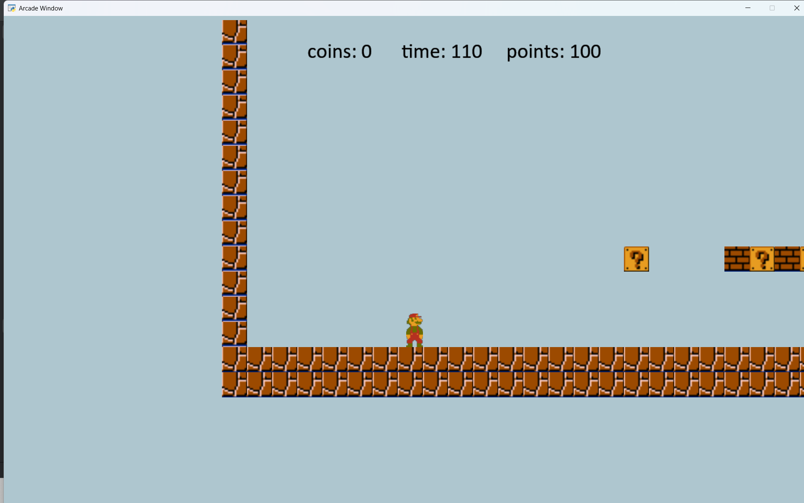
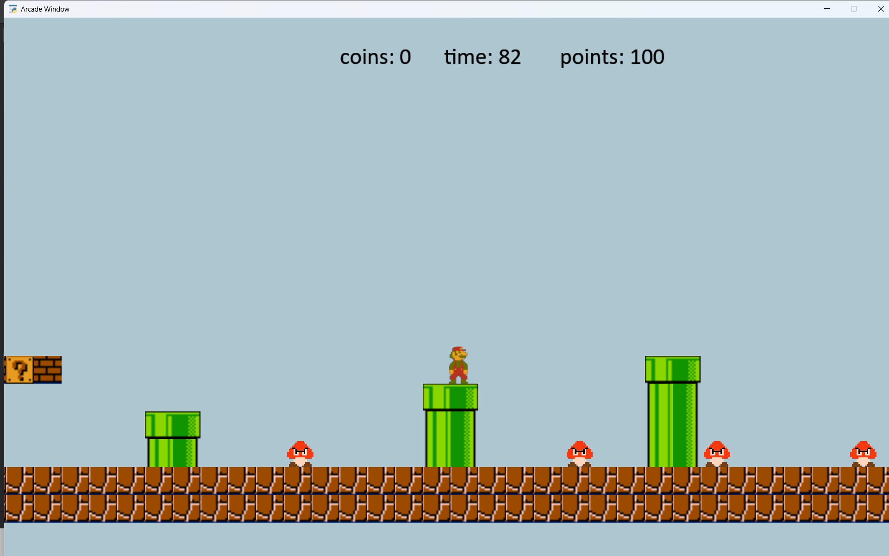
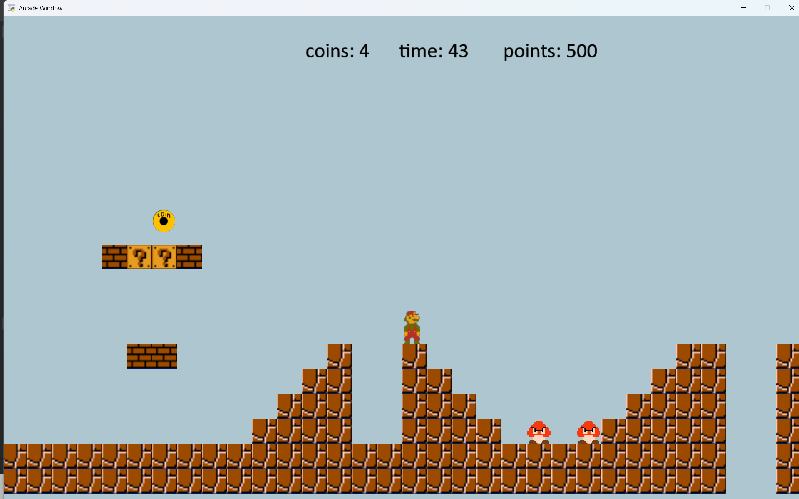

# Max & Ambartsum's Arcade Project 🎮

Учебный проект по разработке 2D-платформера в стиле классического Mario. Создан в рамках обучения во 2-м классе Яндекс Академии (Лицей Академии Яндекса).

## 📝 Описание проекта
Игра представляет собой классический платформер, где игроку необходимо дойти до конца уровня, собирая монеты и сражаясь с врагами. Мы не стремились к полной копии оригинала, а фокусировались на реализации ключевых игровых механик и архитектуре кода.

<p align="center">
  
</p>

## 🛠 Технологии и инструменты
* **Язык программирования:** Python 3.13
* **Библиотека:** [Arcade](https://api.arcade.academy/) — современный фреймворк для создания 2D игр.
* **Редактор уровней:** [Tiled](https://www.mapeditor.org/) — использовался для создания карт уровней (формат `.tmx`).

## ✨ Реализованные фичи
* **Физика и геймплей:** Гравитация, коллизии с объектами, механика прыжков и убийства врагов.
* **Графика:** Система анимаций персонажа, отрисовка уровней через тайлсеты.
* **UI/UX:** Начальное меню, экран паузы, экраны победы и поражения.
* **Система очков:** Подсчет собранных монет и поверженных противников.

<p align="center">
  
</p>

## 👥 Команда проекта
* **Максим (@Cumbarcum):** Разработка основной логики игры, физического движка, систем анимации и интеграция уровней.
* **Амбарцум:** Работа с графикой, подбор и создание ассетов, визуальное оформление.

## 🚀 Технические сложности
Одной из главных проблем стала ошибка при автоматической загрузке стандартных текстур уровня. Чтобы решить её, мы освоили редактор **Tiled** и создали уровень вручную, настроив корректный импорт слоев в код. Также значительное время было уделено реализации плавных переходов анимаций персонажа в зависимости от состояния (ходьба/прыжок/покой).
<p align="center">
  
</p>
## 📥 Инструкция по запуску

1. Убедитесь, что у вас установлен **Python 3.13**.
2. Склонируйте репозиторий или скачайте файлы `Game.py` и папку `assets`.
3. Установите необходимую библиотеку:
   ```bash
   pip install arcade[full]
